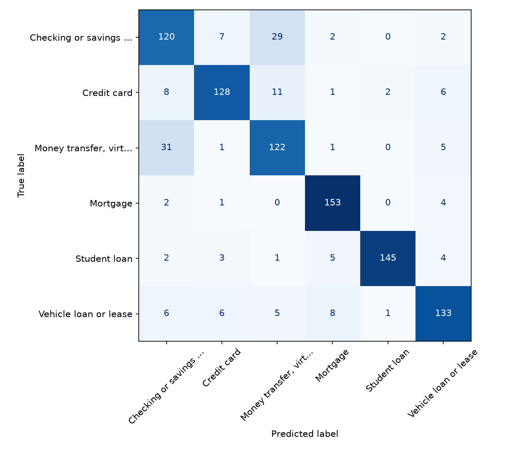
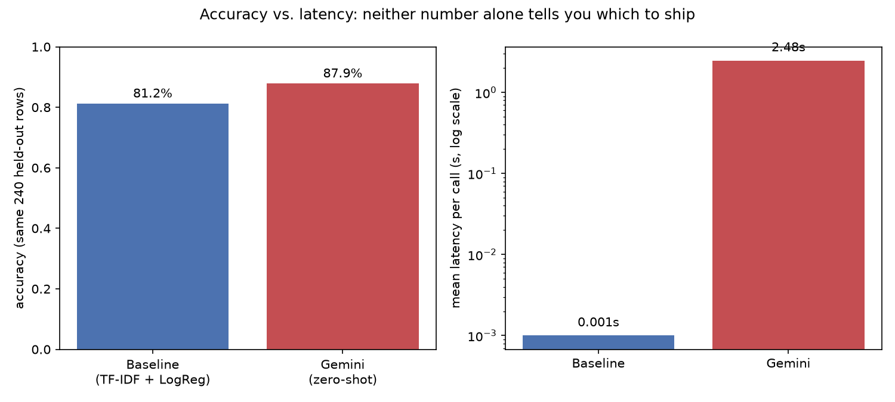

# Consumer Complaint Triage — Classical Baseline vs. LLM Classification


Classifies real consumer-complaint narratives into product categories, then
asks the question that actually decides which approach you'd ship: not
"which is more accurate" in isolation, but accuracy, latency, and output
reliability together, on the exact same held-out rows.

**Stack:** Python, scikit-learn (TF-IDF + logistic regression), Gemini API
(zero-shot classification), Pandas.

## Dataset

Pulled live from the [CFPB Consumer Complaint Database](https://www.consumerfinance.gov/data-research/consumer-complaints/) public API —
not a cleaned Kaggle CSV. 4,800 real complaints (2023-01-01 onward, narrative
opted-in) sampled evenly across 6 product categories: Credit card, Mortgage,
Checking or savings account, Student loan, Vehicle loan or lease, and Money
transfer/virtual currency/money service.

**Sampling is not random** -- the raw corpus is >90% dominated by one
category (credit-reporting complaints) in any recent window, so 800
complaints were pulled per category directly via the API's `product` filter
instead of randomly sampling the whole corpus, which would produce a
near-useless single-class dataset for a classification demo. Disclosed here,
not hidden.

**Real messiness handled, not glossed over:**
- CFPB pre-redacts PII as `XXXX` tokens before publishing -- kept as-is (not
  stripped), since a production system would see the same tokens.
- 28 exact-duplicate narratives (mass-filed templated complaints from
  advocacy/debt-relief groups) were collapsed to one row each before
  splitting -- left in, a model can look artificially good by memorizing one
  template's wording instead of learning the category.
- Narrative length varies by 2 orders of magnitude within every category
  (see `results/figures/narrative_length_by_category.png`).

## Classical baseline

TF-IDF (1-2 grams) + multinomial logistic regression, 80/20 held-out split,
5x3 repeated stratified CV on the training portion for a confidence
interval instead of a single-split number.

| | macro-F1 |
|---|---|
| CV (train only) | 0.836 ± 0.007 |
| Held-out test | 0.840 |

```
                                                    precision  recall  f1-score
Checking or savings account                            0.71    0.75      0.73
Credit card                                             0.88    0.82      0.85
Money transfer, virtual currency, or money service      0.73    0.76      0.74
Mortgage                                                0.90    0.96      0.93
Student loan                                            0.98    0.91      0.94
Vehicle loan or lease                                   0.86    0.84      0.85
```

The errors aren't noise -- they're interpretable. The confusion matrix shows
almost all of the model's mistakes are Checking/Savings vs. Money Transfer
confusions (both share transaction/fee vocabulary), while Mortgage and
Student Loan are cleanly separated (distinct, specific vocabulary):



## LLM comparison

The same held-out test set can't be fully re-run through an LLM API on a
free tier without hitting rate limits, so a stratified sample of 40 rows per
category (240 total) is sent to both approaches and compared on identical
rows -- a fair head-to-head, not two different samples. Zero-shot prompting
(Gemini 3.1 Flash Lite): the category list and the complaint text, nothing
else -- no training data, no examples.

| | accuracy (same 240 rows) | mean latency/call |
|---|---|---|
| Baseline (TF-IDF + LogReg) | 81.2% | ~0.001s (already trained) |
| Gemini (zero-shot) | 87.9% (parseable outputs only) | 2.48s |



The LLM actually wins on accuracy here, with zero labeled training data --
but 1 of 240 outputs (0.4%) didn't match any of the 6 valid categories at
all (the baseline structurally cannot produce an invalid label; an LLM
can), and each call costs roughly 2,500x the baseline's latency. Neither
number alone says which one to ship -- it depends on request volume,
whether training data exists yet, and how costly an occasional
invalid/malformed output is downstream.

**Free-tier quotas and connection overhead turned out to be their own
debugging exercise, worth disclosing rather than hiding:**
- The newest Gemini model on this key (`gemini-3.6-flash`) has a free-tier
  quota of just 20 requests/day -- found by hitting it and reading the 429
  response body, not documented anywhere obvious.
- Its `-lite` sibling (`gemini-3.5-flash-lite`) has a higher quota (500/day)
  but repeated test runs during development burned through that too --
  each model on the same key has its own separate daily quota bucket, so
  switching to a third, untouched model (`gemini-3.1-flash-lite`) is what
  actually unblocked the final run.
- A first working version of `llm_compare.py` opened a fresh
  `requests.post()` connection for every single call. On a network with
  active endpoint-security inspection, that added ~20s/call of pure
  connection overhead -- confirmed by comparing against one-off `curl`
  calls to the same endpoint that consistently completed in ~1.2s.
  Switching to a shared `requests.Session()` (one reused connection
  instead of 240 fresh ones) brought per-call latency back down to ~2.5s.
- An earlier version also passed the API key as a `?key=...` URL query
  parameter. When one call failed with a connection error, the exception
  message included the full URL -- key included -- and that got written
  into a results CSV that was about to be committed. GitHub's push
  protection caught it before anything reached a remote. Fixed by
  authenticating via an `x-goog-api-key` header instead, plus a
  defense-in-depth scrub of any error text before it's saved anywhere.

## Why this matters

A classifier that's accurate in isolation isn't automatically the right
choice for a real triage system. The classical baseline is free per call
and returns one of exactly 6 valid labels, always. An LLM can reason about
phrasing it never saw in training and needs no labeled data to start from --
but costs real latency per call, needs prompting/parsing effort, and can
return an answer outside the valid label set. Which one you'd actually
ship depends on the volume, the label set's stability, and whether you have
training data at all -- not on which one scores higher on a leaderboard.

## Limitations

- 6 categories chosen for clean semantic separation, not the full CFPB
  taxonomy (dozens of product/sub-product combinations) -- a real deployment
  would face far more class overlap.
- LLM comparison uses a 240-row sample, not the full 955-row held-out set,
  because of free-tier rate limits -- reported with that caveat, not as
  equivalent statistical power to the baseline's full-test-set number.
- Zero-shot prompting only; few-shot examples in the prompt would likely
  change the LLM's numbers and isn't tested here.
- Single train/test split for the final baseline report (mitigated by 5x3
  repeated CV for model selection, but the held-out number is still one split).

## How to run

```bash
python -m venv .venv
.venv/Scripts/activate  # or source .venv/bin/activate on Linux/Mac
pip install -r requirements.txt

python src/pull_data.py       # hits the live CFPB API
python src/eda.py
python src/baseline.py
python src/confusion.py

# LLM comparison -- requires an API key
echo "GEMINI_API_KEY=..." > .env
python src/llm_compare.py
```

## Files

```
src/
  pull_data.py     # live CFPB API pull, 6 categories
  clean.py          # dedup templated complaints, drop too-short/missing
  eda.py             # class balance, narrative length by category
  baseline.py       # TF-IDF + LogReg, CV + held-out split
  confusion.py      # confusion matrix on held-out predictions
  llm_compare.py    # same held-out rows through Gemini, zero-shot
  utils.py           # t-based confidence intervals
results/
  figures/           # saved plots
  tables/             # saved CSVs and result summaries
  models/             # fitted baseline pipeline
data/
  complaints_raw.csv # pulled CFPB complaints (public data, PII pre-redacted)
```
