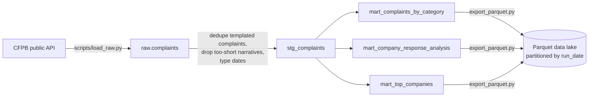

# Complaint Analytics Pipeline — dbt + DuckDB


A real analytics-engineering pipeline, not a notebook: raw data lands in
a warehouse, staging models clean it with tested assumptions, mart
models answer specific business questions, and the whole thing is
documented with lineage -- the pattern behind "data scientist" job
postings that actually mean "build and maintain the tables the rest of
the team queries."

**[Docs site](https://saijignas.github.io/Complaint-Analytics-Pipeline/)** —
generated by `dbt docs generate`, includes the full model lineage graph.

**Stack:** dbt-duckdb, DuckDB, Python (ingestion only), SQL (everything else).

## Pipeline



The whole thing — sensor, extract, `dbt run`, `dbt test`, Parquet export —
runs as a scheduled Airflow DAG. See **[orchestration/](orchestration/)**
for the DAG, how it's verified locally vs. in CI, and why the gap
mattered enough to build.

Real CFPB complaint data pulled live from the public API (same source as
the [Consumer-Complaint-Triage](https://github.com/saijignas/Consumer-Complaint-Triage)
project, but this pipeline does its own ingestion -- no dependency on
that repo to run). 3,000 complaints across 6 product categories.

## Staging: cleaning with tests, not just cleaning

`stg_complaints.sql` drops two real data-quality issues:
- **Templated/mass-filed complaints** -- exact-duplicate narratives,
  collapsed to one row.
- **Too-short narratives** -- under 20 characters after CFPB's PII
  redaction, not a real complaint.

15 dbt tests run on every build:

| Test | What it catches |
|---|---|
| `unique` / `not_null` on `complaint_id` | Duplicate or missing primary keys |
| `accepted_values` on `product` | A category outside the known 6 (a schema drift signal) |
| `not_null` on `narrative`, `was_timely` | Nulls that would silently break downstream aggregates |
| Singular test: `assert_no_negative_routing_days` | A complaint routed to the company *before* it was received -- a real data-integrity check, not a hypothetical one |

All 15 pass on the current data -- but the point of writing them is that
they'd **fail loudly** the next time the API changes a category name or
a date field goes null, instead of a mart silently producing a wrong
number.

## What the marts actually answer

**By category** (`mart_complaints_by_category`):

| Product | Complaints | Avg. narrative length | % timely response | Distinct companies |
|---|---|---|---|---|
| Checking or savings account | 500 | 1,204 | 99.2% | 72 |
| Mortgage | 500 | 1,811 | 98.8% | 104 |
| Student loan | 500 | 1,205 | **95.2%** | 31 |
| Money transfer / virtual currency | 499 | 1,418 | 98.0% | 88 |
| Vehicle loan or lease | 498 | 1,334 | 98.2% | 94 |
| Credit card | 484 | 1,366 | 99.4% | 56 |

Student loan complaints get a noticeably worse timely-response rate than
every other category -- a real signal in this pull, not a rounding
artifact, and something a support-ops team would actually want flagged.

**By response type** (`mart_company_response_analysis`): "Closed with
non-monetary relief" has a 100% timely rate; the 10 complaints marked
"Untimely response" have (tautologically, and correctly) 0% -- a small
built-in sanity check that the pipeline is computing what it claims to.

**Top companies** (`mart_top_companies`, min. 10 complaints): dominated
by loan servicers and major banks (MOHELA, JPMorgan Chase, Wells Fargo),
most holding 98-100% timely-response rates at this volume.

## Why this matters

A dashboard built on top of a one-off script breaks the first time the
upstream data shifts shape, and nobody finds out until someone notices
a number looks wrong. Staging the raw data through tested models means
the pipeline fails at build time, with a specific error pointing at the
specific assumption that broke -- not three marts downstream reporting a
silently wrong number. That's the actual job behind "data scientist"
postings that are really asking for someone who can own a pipeline, not
just fit a model once.

## Limitations

- DuckDB is a real embedded warehouse, not a toy, but it's not the
  distributed warehouse (Snowflake/BigQuery/Redshift) a production
  pipeline at scale would use -- the dbt models themselves would need
  little to no change to point at one, which is the actual argument for
  writing transformations in dbt rather than ad-hoc scripts. The Parquet
  export in `orchestration/` is the honest middle ground: partitioned,
  columnar, and readable by Spark/Athena/BigQuery external tables without
  needing a warehouse migration first.
- The Airflow DAG uses `SequentialExecutor` + SQLite (Airflow's own
  default for a single-node setup) -- correct for demonstrating real
  orchestration, not a claim that this is a horizontally-scaled
  production deployment. See `orchestration/README.md` for exactly what
  was verified locally vs. in CI, and what a production setup would add.
- `accepted_values` on `product` will correctly fail if CFPB ever adds a
  7th category to this specific pull -- intentional, not a bug, but
  worth knowing before assuming a red CI run means something is broken
  rather than "the schema changed and the test caught it."

## How to run

```bash
python -m venv .venv
.venv/Scripts/activate  # or source .venv/bin/activate on Linux/Mac
pip install -r requirements.txt

python scripts/load_raw.py     # pulls fresh CFPB data into warehouse.duckdb

export DBT_PROFILES_DIR=.      # profiles.yml lives in this repo, not ~/.dbt/
dbt run
dbt test
dbt docs generate && dbt docs serve

python scripts/export_parquet.py   # exports the 3 marts to a partitioned data_lake/
```

To run the whole thing as a scheduled Airflow DAG instead of by hand,
see **[orchestration/README.md](orchestration/README.md)**.

## Files

```
scripts/
  load_raw.py                          # live CFPB API pull -> raw.complaints in DuckDB
models/
  staging/
    sources.yml                        # raw.complaints source definition
    stg_complaints.sql                 # cleaning: dedupe, drop too-short, type dates
    schema.yml                         # column tests
  marts/
    mart_complaints_by_category.sql
    mart_company_response_analysis.sql
    mart_top_companies.sql
    schema.yml
tests/
  assert_no_negative_routing_days.sql  # singular data-integrity test
orchestration/
  dags/complaint_pipeline_dag.py       # Airflow DAG: sensor -> extract -> dbt run/test -> Parquet export
  README.md                            # how it's run and verified, locally vs. in CI
docs/                                  # generated dbt docs site (GitHub Pages)
results/tables/                        # mart outputs exported as CSV
data_lake/                             # mart outputs exported as partitioned Parquet (run_date=YYYY-MM-DD)
dbt_project.yml
profiles.yml                           # self-contained: no ~/.dbt/ setup needed
```
