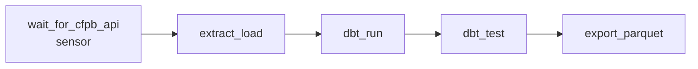

# Orchestration — Apache Airflow

Closes the gap the main pipeline README explicitly flagged: *"a real
pipeline would run on a schedule; this project demonstrates the model
layer and testing discipline, not orchestration/scheduling."* This
directory adds that missing piece.

## DAG: `complaint_pipeline`



| Task | What it does |
|---|---|
| `wait_for_cfpb_api` | Sensor — polls the CFPB API until it responds (or times out after 10 min) before wasting a run on a dead source |
| `extract_load` | Runs `scripts/load_raw.py` — pulls fresh complaints into `raw.complaints` |
| `dbt_run` | Builds staging + mart models |
| `dbt_test` | Runs the 15 dbt tests — a failure here stops the DAG before a bad mart reaches the data lake |
| `export_parquet` | Exports the 3 marts to a `run_date`-partitioned Parquet data lake (`scripts/export_parquet.py`) |

`extract_load` has `retries=2` with a 5-minute delay — the one task that
depends on a flaky external network call, not a local computation.

## Why tasks shell out to a separate venv

`dbt_run` and `dbt_test` invoke `pipeline/.venv/bin/dbt` (or
`Scripts\dbt.exe` on Windows) directly rather than importing dbt into
Airflow's own Python environment. Airflow and dbt-core pin overlapping
dependencies (click, Jinja2, etc.) under different constraint sets —
isolating dbt's environment from the orchestrator's is the standard way
real teams avoid that conflict, not a workaround specific to this repo.

## How to run it for real

```bash
cd pipeline
python -m venv .venv
.venv/Scripts/activate   # or source .venv/bin/activate on Linux/Mac
pip install -r requirements.txt

pip install "apache-airflow==2.10.4" \
  --constraint "https://raw.githubusercontent.com/apache/airflow/constraints-2.10.4/constraints-3.11.txt"

export AIRFLOW_HOME=$(pwd)/orchestration/airflow_home
export AIRFLOW__CORE__DAGS_FOLDER=$(pwd)/orchestration/dags
export AIRFLOW__CORE__LOAD_EXAMPLES=False
airflow db migrate

# Full 5-task run for a given logical date (hits the live CFPB API):
airflow dags test complaint_pipeline 2026-09-09

# Or run one task in isolation, ignoring upstream state:
airflow tasks test complaint_pipeline export_parquet 2026-09-09
```

## What's verified where

- **Locally (this environment):** the full 5-task DAG, including the live
  CFPB sensor and extract, run end-to-end via `airflow dags test` — real
  network call, real dbt build, real Parquet files written to
  `data_lake/`.
- **In CI:** only `dbt_run`, `dbt_test`, and `export_parquet` run, each via
  `airflow tasks test` against the already-committed `warehouse.duckdb` —
  deterministic and network-free, for the same reason the plain dbt CI
  job doesn't re-pull from the live API on every push. CI also asserts
  the DAG has zero import errors.

## Limitations

- Uses Airflow's default `SequentialExecutor` + SQLite metadata DB —
  correct for demonstrating the orchestration logic, but a production
  deployment would run `LocalExecutor`/`CeleryExecutor` against Postgres
  for concurrency and durability.
- No Dockerized deployment is included here. A docker-compose setup was
  considered, but Docker wasn't available to verify it end-to-end in the
  environment this was built in — rather than ship an unverified compose
  file, this only documents the path that was actually run and checked.
- The Parquet export partitions by `run_date` on local disk. A production
  lake would write the same partitioned layout to S3/GCS/ADLS — the
  `COPY ... TO ...` call would only need a different target path.
